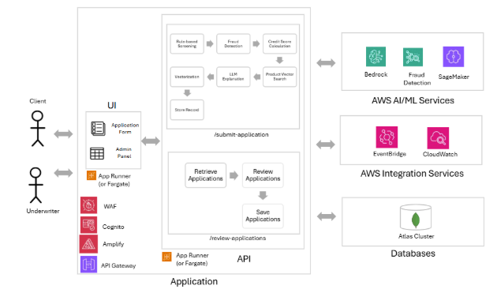

# Credit Application

This is a full-stack AI-powered credit scoring system built with:
- **FastAPI** (backend)
- **AWS Bedrock** for LLM risk summarization
- **AWS Fraud Detector or Amazon SageMaker** for anomaly detection
- **React** (frontend with TailwindCSS and lucide-react)
- **MongoDB** (recommended for storage and optional vector indexing)

## Features

- AI-generated credit score and breakdown
- Visual sliders and tabbed UI
- LLM-generated risk summary and suggestions
- Anomaly detection service for suspicious applications
- Modular FastAPI backend

## Architecture
User Input → React UI → FastAPI (/score) → Rule-based scoring + Bedrock LLM + Anomaly detection → JSON → UI rendering
How a Credit Score Is Generated


### Flow Diagram


### Architectural Diagram



## AWS Configuration

Before running the application, configure AWS access and model settings.

1. Install the [AWS CLI](https://docs.aws.amazon.com/cli/latest/userguide/getting-started-install.html) and run `aws configure` or set environment variables.

```bash
AWS_ACCESS_KEY_ID=your-access-key
AWS_SECRET_ACCESS_KEY=your-secret-key
AWS_REGION=us-east-1
```

2. Enable [Amazon Bedrock](https://aws.amazon.com/bedrock/) and configure cross-region inference with an inference profile:

```bash
# Region hosting the text inference profile
BEDROCK_TEXT_REGION=us-west-2

# Provide one of the following for the profile
BEDROCK_TEXT_INFERENCE_PROFILE_ARN=arn:aws:bedrock:us-west-2:ACCOUNT_ID:inference-profile/my-text-profile
BEDROCK_TEXT_INFERENCE_PROFILE_ID=ip-1234567890abcdef

# Optional embedding profile
BEDROCK_EMBED_REGION=us-west-2
BEDROCK_EMBED_INFERENCE_PROFILE_ARN=arn:aws:bedrock:us-west-2:ACCOUNT_ID:inference-profile/my-embed-profile
```

When an inference profile variable is set, the backend uses cross-region inference and omits the `modelId` in Bedrock requests.

3. Deploy an anomaly detection service using [AWS Fraud Detector](https://aws.amazon.com/fraud-detector/) or a [SageMaker](https://aws.amazon.com/sagemaker/) endpoint and capture its identifier:

```bash
FRAUD_DETECTOR_MODEL_ARN=arn:aws:frauddetector:us-east-1:123456789012:detector/my-detector   # if using Fraud Detector
SAGEMAKER_ENDPOINT_NAME=my-anomaly-endpoint                                                   # if using SageMaker
```

4. Include additional application variables such as the MongoDB connection string:

```bash
MONGODB_URI=mongodb://localhost:27017
```

Store these values in a `.env` file in `backend` or export them in your shell.

### Backend
```bash
cd backend
# create .env and add the variables described above
pip install -r requirements.txt
uvicorn main:app --reload
```

### Frontend
```bash
cd frontend
npm install
npm run dev   # start development server
npm run build # create production build
npm start     # preview production build
```

Visit: http://localhost:5173/

